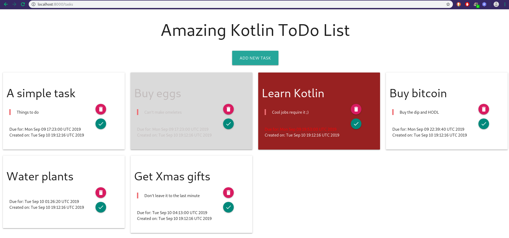
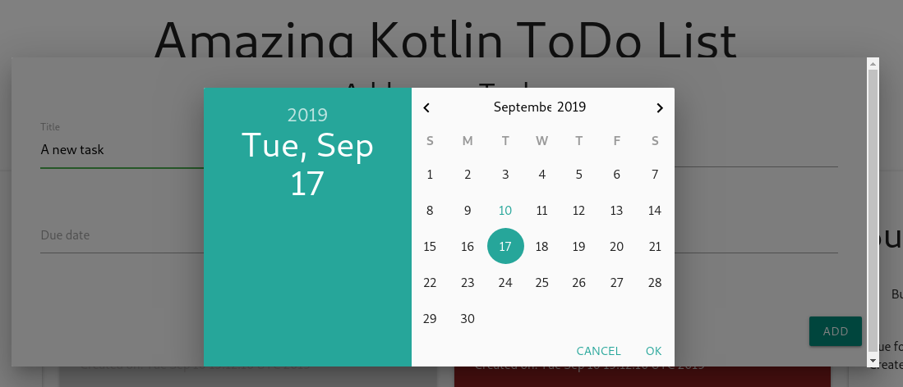

# To-do App - A Kotlin introduction and Dev diary

Learning project in the Kotlin language.

This is my first contact with Kotlin (and Java) and my first time attempting any kind of public development diary.




## Goals
* Gain initial insight into the Kotlin language and workflow
* Avoid using frameworks that obfuscates how Kotlin works (the goals is to LEARN Kotlin not make the code small or super efficient)
* Get a sense for the differences in philosophy compared to Python
* Have a working To-Do app with a browser interface

## Final project structure
```
src/main/kotlin
|
|_ Server.kt    (main script, view/API)
|_ TaskClass.kt (A data class representing a task in the ToDo app)
|_ TaskDAO.kt   (Data Access Object glueing Tasks to the API)
|_ main.kt      (throw away script used for iterative testing)
```

## Tools used
* [Intellij](https://www.jetbrains.com/idea/) IDEA (IDE)
* [Javalin](http://javalin.io) (lightweight web framework)
* [Gradle](https://gradle.org/) (build tool)
* [Mustache](http://mustache.github.io) (templating engine)
* [Materialize](https://materializecss.com) (CSS/JS templates)

## Captain's Log
I decided to document my development of this small app and my first experiences with Kotlin as a Python developer.

* [Date 1.0](devdiary/d1.md)
* [Date 2.0](devdiary/d2.md)
* [Date 3.0](devdiary/d3.md)
* [Date 4.0](devdiary/d4.md)


