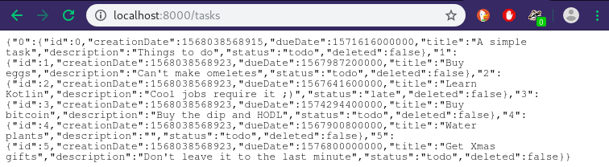
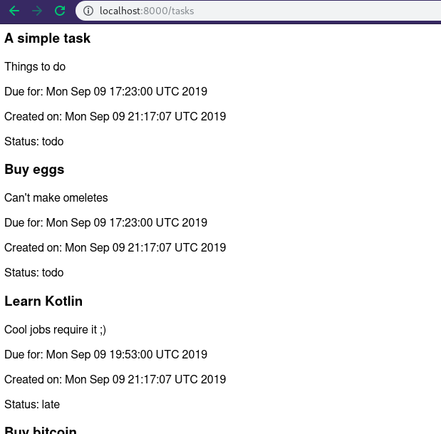

### Date 3.0
After a weekend break, time to get back at it. First thing is spending a few minutes getting back on track and seeing what the main goals of the day are. I need to finish up the `TaskDAO` class so I can start working on the "view"/API. I'm also breaking up this dev diary into several parts since it's getting pretty big to just leave it on a single readme file.

#### 3.1
Finished up `TaskDAO` (at least for these initial features). All I needed to do was implement the `completeTask` method.

#### 3.2
Started building the API. Since I'm unfamiliar with Javalin I am having to depend and adapt their tutorial, but it seems straightforward enough.
An App is initialized with a Javalin class and some initial configuration is done for error handling. App is started on a chosen port.

The meat of the API happens in the routing configuration where the API endpoints will be defined. In this todo app these will basically represent the "CRUD" methods defined earlier in the `TaskDAO` class.

#### 3.3
Hm... first time running the server and there is a complaint about a missing dependency called 'Jackson'. Conveniently the error message suggests adding this dependency to build.gradle.

#### 3.4
And it works! Beautiful :) That was easy enough... feels like cheating :P

#### 3.5
Trying out the item update methods. For this I'll use `curl` to makes things simple.

`curl -X UPDATE http://localhost:8000/tasks/complete/1` successfully marks task with ID 1 as complete and `curl -X DELETE http://localhost:8000/tasks/complete/1` deletes it.

#### 3.6
When testing the `add` method I realized I had an issue and that was how I would pass the `dueDate` to my class constructor. The way the DAO and Task class were setup, `dueDate` expected a `java.util.Date` class as input.

I updated `TaskClass` to work with a long values representing Unix Time instead (for both dueDate and creationDate fields).

`TaskDAO.addTask` was also updated to reflect this change. Now the API should pass a UnixTime for the `dueDate` argument when creating a new Task. And when the time comes, the view will parse this unixtime to show the user a formated string.

So now `curl -d "dueDate=1569049781979&title=A test title&desc=A short description" http://localhost:8000/tasks/add`, for example, adds a new entry to the tasks data store.

#### 3.7
By this point the app is missing one major backend part which I will handle later: a job that routinely updates task statuses from 'todo' to 'late' as needed.

So now I need to find a way to transform my API endpoints into a usable interface for the user. In Python I would probably use a template framework like Jinja. I need to see what are the easiest options for this Kotlin/Javalin combo.

After setting up the user interface and the backend routine job, this exercise should be done.

#### 3.8
Decided to go with [Mustache](http://mustache.github.io) as the templating system since it is already supported by Javalin.

For now I will use the API/Server file to handle the transformation needed to use the templating system... **but this is not ideal**. I should keep the API isolated from my views but while I test things with this templating system I'll keep things simple.

Transforming the date fields into formatted strings required a bit more work than I expected because of the static types. I created a temporary class with new static types for the date fields and iterated over the tasks I wanted to display. I feel there is some mapping method I could not discover yet that would make my job trivial but I rather get this first version working as is and explore ways to improve/refactor my code later.

Now I have a new file `tasks.mustache` which will be used by the templating system.

Adding interaction was very simple. I just needed to incorporate some buttons into my template and linked them to my API endpoints. **However, this is not safe since there is no CSRF protection**.

Next step is to add a button/form for the user to add a new task (I would like to use a modal for this, so I might start working with styling first).

